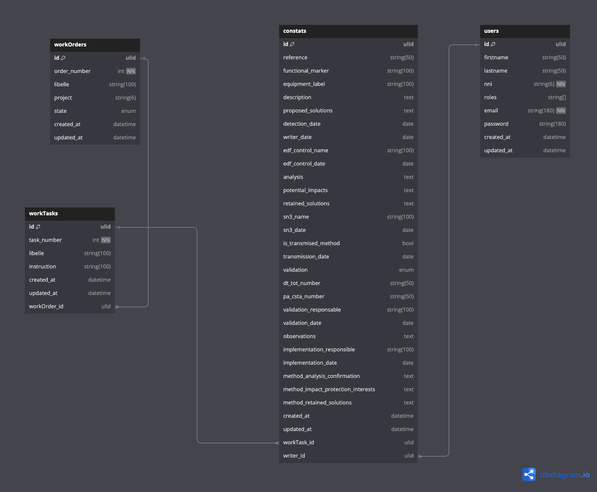

# 🚀 Easy Constat

**Easy Constat** permet de créer, suivre et piloter les fiches de constats.

## 📋 Table des matières

- [📦 Installation](#-installation)
- [🛠️ Utilisation](#-utilisation)
- [🤝 Contribution](#-contribution)
- [🧪 Tests](#-tests)
- [🚀 Déploiement](#-déploiement)
- [📜 Licence](#-licence)
- [📚 Documentation](#-documentation)
- [📞 Contact](#-contact)

## 📦 Installation

Pour démarrer le projet, suivez les étapes ci-dessous :

1. Clonez le projet depuis GitHub :

    ```sh
    git clone https://github.com/Papoel/Anomalie_Materiel.git
    ```

2. Installez les dépendances avec Composer :

    ```sh
    composer install
    ```

3. Démarrez les services Docker avec Castor :

    ```sh
    castor start
    ```

4. Ouvrez votre IDE et commencez à travailler sur le projet.

## 🛠️ Utilisation

Pour l'instant, nous n'avons pas encore de captures d'écran ou de documentation détaillée sur l'utilisation. Ces informations seront ajoutées une fois le projet terminé.

## 🤝 Contribution

Le projet est open source et nous accueillons les contributions. Pour l'instant, nous n'avons pas de directives spécifiques pour les contributeurs. Si vous souhaitez contribuer, vous pouvez simplement forker le projet et soumettre une pull request.

## 🧪 Tests

Les tests seront ajoutés progressivement au fur et à mesure du développement du projet. Pour l'instant, il n'y a pas de suite de tests spécifique à exécuter.

## 🚀 Déploiement

Aucun outil spécifique n'est prévu pour le déploiement pour le moment.

## 📜 Licence

Ce projet est sous licence MIT. Voir le fichier [LICENSE](LICENSE) pour plus de détails.

## 📚 Documentation

### Schéma de la base de données

Voici le schéma de la base de données actuelle :



## 📞 Contact

Pour toute question ou suggestion, vous pouvez me contacter par les moyens suivants :

- 📧 Email : [bridevproject@gmail.com](mailto:bridevproject@gmail.com)
- 💬 Discord : #papoel
- 🐙 GitHub : [https://www.github.com/Papoel](https://www.github.com/Papoel)

---

Merci d'utiliser **Easy Constat** ! 🚀
